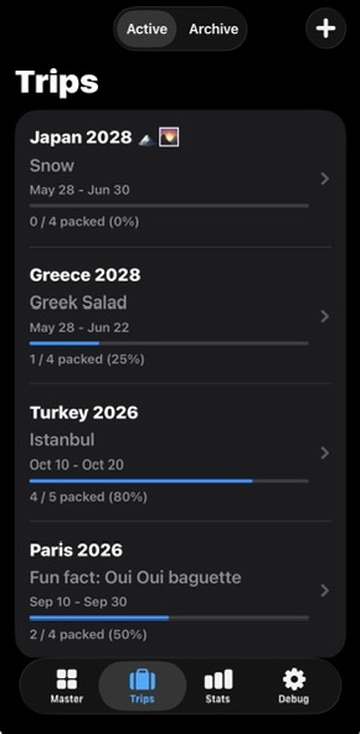
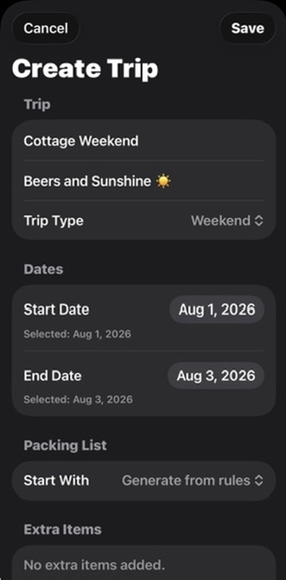
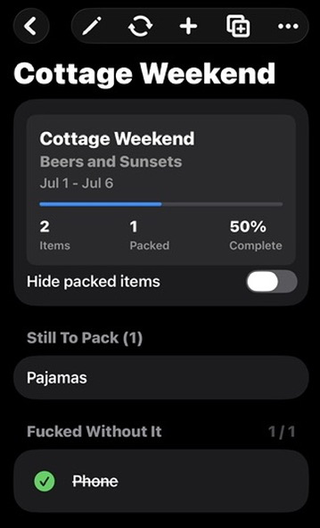
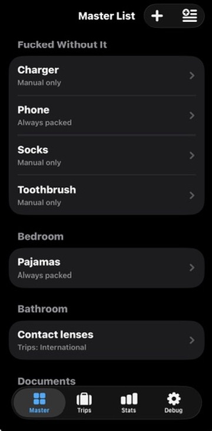
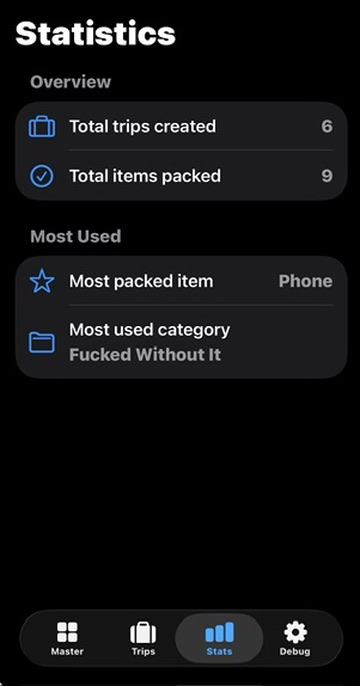

# PackMatrix

[](https://swift.org)
[](https://developer.apple.com/xcode/swiftui/)
[](https://developer.apple.com/xcode/swiftdata/)
[](https://developer.apple.com)
[](#roadmap)

PackMatrix is a local-first SwiftUI packing list app for iPhone and Mac. It helps travelers maintain a reusable master packing inventory, organize items by category, and generate trip-specific packing checklists from simple packing rules.

The project is built with SwiftUI and SwiftData, with no authentication, backend service, Firebase dependency, or networking layer. It is designed to be simple, privacy-friendly, and ready to evolve toward a future public release.

## Table of Contents

- [Features](#features)
- [Screenshots](#screenshots)
- [Installation](#installation)
- [Running Locally](#running-locally)
- [Project Structure](#project-structure)
- [Architecture Overview](#architecture-overview)
- [Data Model Overview](#data-model-overview)
- [Packing Rules](#packing-rules)
- [Documentation Structure](#documentation-structure)
- [Roadmap](#roadmap)
- [Future Enhancements](#future-enhancements)
- [Contributing](#contributing)
- [License](#license)

## Features

- Master packing inventory grouped by room or category
- Add, edit, quick-add, and delete master packing items
- Global duplicate item prevention with case-insensitive matching
- Trip creation with destination, date range, and trip type
- Rule-based checklist generation
- Extra items during trip creation
- Manual add and remove support for trip checklists
- Packing progress tracking
- Checklist grouping by category
- Hide packed items toggle
- Still To Pack summary
- Trip duplication
- Trip archive and restore flow
- Packing templates
- Recently packed item suggestions
- Basic packing statistics
- Local debug/health screen
- Toast notifications for key actions
- Adaptive iPhone and Mac layout using `TabView`, `NavigationStack`, and `NavigationSplitView`

## Screenshots

### Trip Dashboard



Displays active and archived trips, trip destinations, date ranges, packed item counts, and completion percentages.

### Create Trip



Shows the trip creation flow, including trip details, trip type selection, date selection, packing list source, and extra items.

### Packing Checklist



Shows the trip checklist experience with packing progress, remaining items, category grouping, and packed item state.

### Master Packing List



Displays the reusable master inventory grouped by category, with packing rules summarized for each item.

### Statistics



Summarizes total trips, packed item counts, the most packed item, and the most used packing category.

## Installation

### Requirements

| Tool | Version |
| --- | --- |
| Xcode | 15 or later recommended |
| Swift | Swift 6 project settings |
| iOS | iOS 17.0 or later |
| macOS | macOS 14.0 or later |

### Clone the Repository

```bash
git clone https://github.com/your-username/PackMatrix.git
cd PackMatrix
```

Open the project in Xcode:

```bash
open PackMatrix.xcodeproj
```

## Running Locally

1. Open `PackMatrix.xcodeproj` in Xcode.
2. Select the `PackMatrix` scheme.
3. Choose an iPhone simulator, iPad simulator, or Mac destination.
4. Press `Command + R`.

You can also build from the command line:

```bash
xcodebuild \
  -project PackMatrix.xcodeproj \
  -scheme PackMatrix \
  -destination 'generic/platform=iOS' \
  CODE_SIGNING_ALLOWED=NO \
  build
```

For macOS:

```bash
xcodebuild \
  -project PackMatrix.xcodeproj \
  -scheme PackMatrix \
  -destination 'generic/platform=macOS' \
  CODE_SIGNING_ALLOWED=NO \
  build
```

## Project Structure

```text
PackMatrix/
├── PackMatrix/
│   ├── Models.swift
│   ├── PackMatrixApp.swift
│   ├── ContentView.swift
│   ├── MasterListView.swift
│   ├── AddItemView.swift
│   ├── QuickAddItemsView.swift
│   ├── ItemDetailView.swift
│   ├── TripListView.swift
│   ├── CreateTripView.swift
│   ├── TripDetailView.swift
│   ├── PackingRuleEngine.swift
│   ├── SampleData.swift
│   ├── StatisticsView.swift
│   ├── DebugView.swift
│   ├── ToastView.swift
│   └── Assets.xcassets/
├── docs/
│   ├── images/
│   ├── architecture/
│   └── screenshots/
├── README.md
├── CONTRIBUTING.md
└── CHANGELOG.md
```

## Architecture Overview

PackMatrix uses a straightforward SwiftUI architecture with SwiftData-backed models and focused view files.

| Layer | Responsibility |
| --- | --- |
| SwiftUI views | Presentation, navigation, forms, lists, and checklist interactions |
| SwiftData models | Local persistence for categories, items, trips, checklist rows, and templates |
| Rule engine | Checklist generation, duplicate prevention, manual additions, trip duplication, and template application |
| Helpers | Grouping, formatting, toast presentation, and sample data seeding |

### SwiftUI

The app uses native SwiftUI views throughout. Compact devices use `TabView` with `NavigationStack`; wider layouts use `NavigationSplitView` for a more Mac and iPad-friendly experience.

### SwiftData

All primary app data is stored locally using SwiftData. The `PackMatrixApp` entry point registers the app models in a single model container.

### MVVM-Style Organization

The project follows a lightweight MVVM-style organization. Views own simple UI state, SwiftData models represent persisted domain data, and `PackingListGenerator` contains checklist generation behavior that would otherwise clutter views.

### Local-First Storage

PackMatrix is local-first by design. User data stays on device, and the current implementation does not require sign-in, a backend, Firebase, or networking.

### Future CloudKit Support

CloudKit sync is a planned future enhancement. The current SwiftData model structure keeps persistence centralized, which should make future iCloud sync work more approachable.

For more detail, see [docs/architecture/overview.md](docs/architecture/overview.md).

## Data Model Overview

| Model | Purpose |
| --- | --- |
| `PackingCategory` | Groups master packing items by room or category and stores display order |
| `PackingItem` | Represents a reusable master packing item with quantity, notes, category, trip type rules, destination rules, and optional/always-pack flags |
| `Trip` | Represents a trip with name, destination, dates, selected trip type, archive status, and checklist items |
| `TripPackingItem` | Represents one checklist row for a trip, including packed state, quantity, notes, and whether it was manually added |
| `TripType` | Defines supported trip types: weekend, international, domestic, beach, work, and family visit |
| `PackingTemplate` | Stores a reusable template based on a trip packing list |
| `PackingTemplateItem` | Stores the item rows that belong to a packing template |

## Packing Rules

Checklist generation currently includes items when:

- The item is marked `isAlwaysPacked`
- The item is associated with the selected `TripType`
- The item is manually added to the trip
- The item comes from a duplicated trip or selected template

Duplicate checklist rows are prevented by tracking the underlying `PackingItem` identifiers already added to the trip.

## Documentation Structure

Recommended documentation layout:

```text
docs/
├── images/
├── architecture/
└── screenshots/
```

- `docs/images/`: README images, diagrams, and promotional assets
- `docs/architecture/`: technical architecture notes
- `docs/screenshots/`: app screenshots for future App Store and GitHub usage

## Roadmap

### Completed

- Master packing list
- Trip creation
- Checklist generation
- Quick add items
- Duplicate prevention
- Progress tracking
- Toast notifications
- Trip archive and restore
- Trip duplication
- Packing templates
- Basic statistics
- App icon configuration

### Planned

- CloudKit sync
- Templates refinements
- Travel reminders
- App Store release
- Export/share packing lists

## Future Enhancements

- iCloud sync across iPhone, iPad, and Mac
- App Store metadata, screenshots, and privacy details
- Share sheet support for trip checklists
- Printable checklist export
- Reminder notifications before a trip starts
- Smarter suggestions based on destination, weather, and trip history
- Unit tests for checklist generation and duplicate prevention
- UI tests for trip creation and checklist workflows

## Contributing

Contributions are welcome once the project is prepared for public collaboration. Please read [CONTRIBUTING.md](CONTRIBUTING.md) for setup, workflow, and pull request guidelines.

## License

This project does not currently declare an open-source license. Before publishing publicly, add a `LICENSE` file and update this section.

Suggested options:

- MIT License for broad open-source reuse
- Apache License 2.0 for explicit patent language
- Proprietary license if the app will remain closed-source
